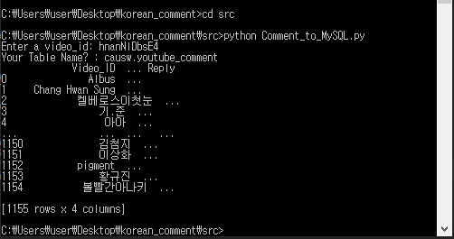
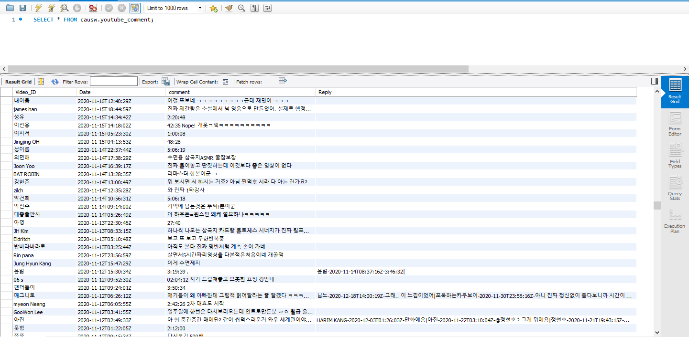

YouTube-Comment-TO-MySQL
=============
Comment_to_MySQL made by python language program, which works searching youtube comment by using Youtube API

This program's Result is stored into MySQL table schema

Using this data and list, I Insert this data into MySQL table,

## Prerequisite

