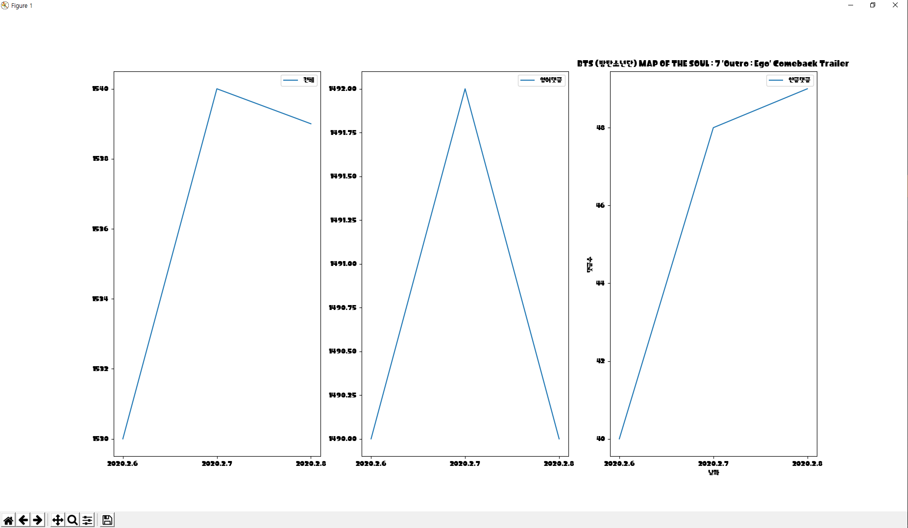

YouTube-Comment-TO-MySQL
=============
Comment_to_MySQL made by **python** language program, which works searching youtube comment by using Youtube API

This program's Result is stored into MySQL table schema


## Code style


## Screenshots


Using this data and list, I Insert this data into MySQL table,


## Prerequisite Module

You can use **requirments.txt** to install necessary module simply.

  
  
  
  
  
  
  
  


## Features

This program using Youtube API crawls **much more youtube video comment** than using selenium and beautifulsoup python module.

| [Left] using selenium and chromedriver                      | [Right] using youtube API and MySQL                          |
| ----------------------------------------------------------- | ------------------------------------------------------------ |
| Max comment = 1500 <br />total video's comment = 15,000,000 | Max comment = up to 15,000,000 <br />total video's comment = 15,000,000 |
|   |  |

This program is slower than the way to selenium crawling But more precise than that way

If you're using **Bigdata and Artificial Intelligence** or if you're a **Data Scientist and Data Analyst** , You must need to this program to use much many youtube comment data and to analyze youtube environment.


## Installation

1. clone this repository to local

2. issue your own OAuth 2.0 Client ID json file >>> <a href="https://github.com/falconlee236/YouTube-Comment-TO-MySQL/tree/master/docs/GuideLine.md "  target="_blank">Issue Guideline</a>

3. Rename OAuth json file to `client_secret.json`

4. In Terminal, Change your main directory and write this code

   ```python
   > python src\Comment_to_MySQL.py
   "Enter a video_id" : #Enter target video id
   '''
   if your target youtube address is https://www.youtube.com/watch?v=YWt4wmZ_EMI
   you should put target video id YWt4wmZ_EMI
   '''
   ```

5. IF Authorization is successfully, You will see 
   `"Please visit this URL to authorize this application : ~~~~~~~~"`

   `"Enter the authorization code :"` 
   After visit that URL and Complete Authorization, get authorization code and enter the code

6. IF You execute program first, You will enter MySQL info to connect DB

   ```python
   "Your user name? Ex) root : "
   "Your user passwd? Ex) 123456 : "
   "Your host name? Ex) localhost : "
   "Your Database Schema name? Ex) sys : "
   "charset of Database Schema? Ex) utf8 : "
   ```

   After that, the json file is made in local repository, `MySQL_Auth.json`


## API Reference

Depending on the size of the project, if it is small and simple enough the reference docs can be added to the README. For medium size to larger projects it is important to at least provide a link to where the API reference docs live.


## How to use?

If people like your project they’ll want to learn how they can use it. To do so include step by step guide to use your project.


