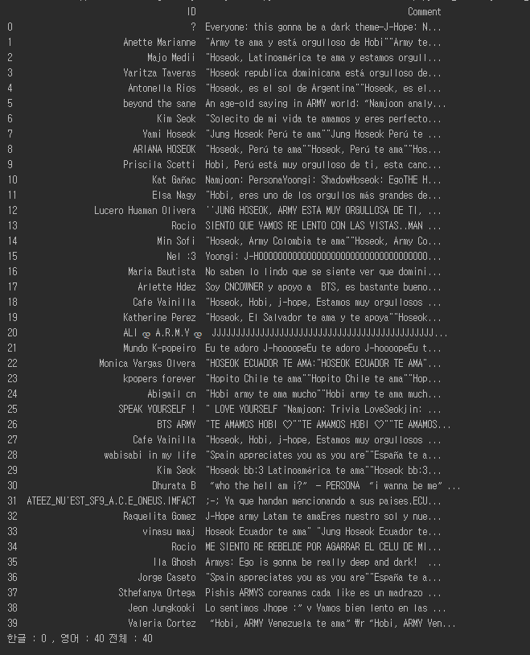

Youtube comment analyze and graph
=============
This program made by python language program, which works searching youtube korean comment, english comment and entire comment 
from using selenium and google webdriver

As using these data, I made list made by numpy module and pandas

Using this data and list, I Insert this data into MySQL table, causw.youtube_comment
